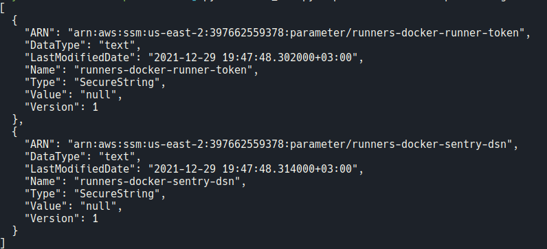

# aws-ssm-parameters

## Install
Just install [Python3](https://www.python.org/downloads/) and `boto3` module.

```bash
sudo apt install -y python3 python3-pip python3-venv
```
Better practice is to use `venv`.
```bash
python3 -m venv venv
```
```bash
source venv/bin/activate
```
```bash
pip3 install -r requirements.txt
```
To exit the venv just use `deactivate` command.

## Usage

### Arguments

**R** - Required  
**O** - Optional  
**BR** - Both required

| Argument            | Description |
| :---                |    :----    |
| `-P`, `--profile`   | (R) Specify the AWS profile for script's session |
| `-p`, `--path`      | (R) SSM parameters path ex: `/my/first/param/` |
| `-f`, `--from`      | (O/BR1) Specify a **part** of string to rename |
| `-t`, `--to`        | (O/BR1) Specify a new **part** of string |
| `-U`, `--upload`    | (O) Flag to upload new parameters |
| `-o`, `--overwrite` | (O) Flag to overwrite parameters |
| `-D`, `--delete`    | (O) Flag to delete the parameters |
| `-r`, `--read`      | (O) Flag to read the parameters from JSON file in current folder |
| `-q`, `--quiet`   | (O) Flag to don't make backups |
| `-s`, `--save`      | (O) Flag to save the parameters into JSON file |
| `-c`, `--clear`     | (O) Flag to delete all `parameters_dump_*.json` files in current directory |


Use both `--replace` and `--to` arguments!  

## Example

Replace `a` to `b` in all parameter names from `/` path in SSM
```bash
python3 ssm.py --profile default --path /sokol/dev/ --from dev --to qa --upload
```
Get all parameters by path
```bash
python3 ssm.py --profile default --path /
```

Delete parameters by path
```bash
python3 ssm.py -P default -p /sokol/dev/ -D
```
